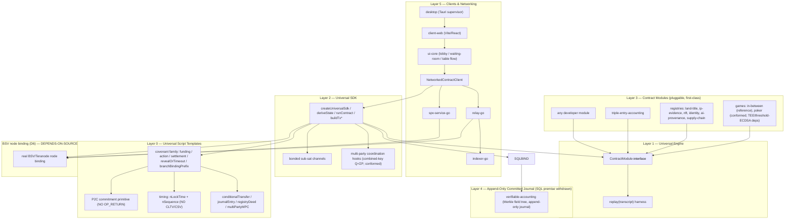

# bsv-universal-sdk — Engineering Specification

**Status:** v0.1 — DRAFT SPECIFICATION FOR BUILD. Not a validated final spec.
**Format:** Specification only. This document tells `claude-code` what to build and how to prove it. It contains interface signatures, script-template structure, schemas, test matrices, and pseudo-algorithms. It contains **no implementation code** by intent.
**Target chain:** BSV (Bitcoin SV / Teranode) **only**. No BTC. No Bitcoin Core assumptions. Confusing BTC and BSV is a build failure.

---

## 0. Document Control

### 0.1 Verification ledger (epistemic status of inputs)

This spec is honest about what its author verified. Every downstream requirement inherits the status of the input it rests on.

| Input | Type | Status | Use in this spec |
|---|---|---|---|
| `formal-architecture-v1.docx` | UTF-8 markdown (read in full) | **VERIFIED** | Foundational architecture the SDK generalizes. |
| `wallet_bonus_cassandra_schema.cql` | text (read in full) | **VERIFIED** | Grounds the triple-entry-accounting module. |
| `Anonymous_VerifiableSetShuffling_v14_1` | ZIP archive (per-page JPEG + extracted `.txt`); **read in full** | **VERIFIED (read)** | The Burns-Wright EC set-shuffle (Protocol A combined-key additive shuffle; Protocol B in-script PRNG selection). Conformed in `SOURCE-CONFORMANCE.md` §5. |
| `Fair_Play_Transactions_8_1` | ZIP archive (text); **read in full** | **VERIFIED (read)** | Fair-play collateral transactions; 5-check locking script; canonical scalar derivation. Timing is tx-level `nLockTime`/`nSequence` (confirms project rule). |
| `strict_provable_fairness_19_1` | ZIP archive (text); **read in full** | **VERIFIED (read)** | The L0–L5 fairness hierarchy; ΠSO / ΠMP constructions; 7-adversary analysis. Adopted in `SOURCE-CONFORMANCE.md` §6. |
| `bsvm_dlt_main_v30_named` and `bsvm_dlt_*`, `bsvmwhitepaper_3` | ZIP archives (text); **characterised** | **VERIFIED (read) — premise corrected** | **BSVM is a validity-proven EVM Layer-2 on BSV (STARK + covenant UTXO chains), NOT an on-chain SQL engine.** Introduces **Rúnar**, a BSV Script compiler. Uses `OP_RETURN` (DA/deposits) and CSV (bridge) — both banned. See §11 and `SOURCE-CONFORMANCE.md` §3–§4. |
| `bsvpoker_dlt_v27_named`, `bsvpoker_dlt_online_appendix_v27_named` | ZIP archives (text); **architecture + state-machine + settlement read** | **VERIFIED (read)** | Card-shuffle NFT poker on BSVM; composes shuffle + BSVM + Savanah-Wright threshold ECDSA + device TEEs. Uses CLTV (banned). Conformed in `SOURCE-CONFORMANCE.md` §8 and `poker-spec.md`. |
| `Database_Technical_Profiles`, `pra_fixedprobe_v08` | ZIP archives | **NOT READ** | Not relied on by any requirement. |
| Existing `bsv-poker` codebase (`(D6)`, `triple-entry-bsv-sql`, `verifiable-accounting-bsv`, `cardtable`) | not present in project | **NOT SEEN** | Spec defines target interfaces; it does not transcribe this code. `REQ-NODE-001..003` remain `DEPENDS-ON-SOURCE`. |
| **Savanah-Wright threshold ECDSA [2019]** | referenced by the poker source; not in the project files | **NOT SEEN** | Transitive `DEPENDS-ON-SOURCE`: poker settlement (threshold ECDSA) depends on it. |

`DEPENDS-ON-SOURCE` means: **before building that part, read the named document and make this spec conform to it.** The source documents above have now been read; the residual `DEPENDS-ON-SOURCE` items are the absent `bsv-poker` codebase (`REQ-NODE-001..003`) and the absent Savanah-Wright paper. If a source contradicts this document, the source wins and this document is amended — as was done for the Layer-4 SQL premise (§11).

### 0.2 Conflict found in the inputs (and the faithful replacements)

`formal-architecture-v1.docx` §5.7.4 mandates `OP_CHECKLOCKTIMEVERIFY` and `OP_CHECKSEQUENCEVERIFY`; §5.4 gates timeouts on "block height or timestamp thresholds." **These are banned in this project (BTC artifacts; treated as no-ops on BSV post-Genesis).**

The reading of the source papers **reinforces** this conflict rather than isolating it: the source papers themselves use the banned constructs.
- **Poker** uses `OP_CHECKLOCKTIMEVERIFY` for the per-card reveal deadline and `expire` (source pp 34-36, 46, 57).
- **BSVM** uses `OP_CHECKSEQUENCEVERIFY` for bridge withdrawal timelocks (source main pp 26-27).
- **Shuffle Protocol B** and **BSVM** (DA/deposits) use `OP_RETURN`; fair-play has an optional `OP_RETURN` mapping path.

Faithful, substance-preserving replacements (each already used by the same sources elsewhere) are specified in `SOURCE-CONFORMANCE.md` §2 and applied in §5, §6, §11, and `poker-spec.md`:
- **CLTV/CSV → transaction-level `nLockTime` (absolute) + `nSequence` (relative) + pre-signed recovery/expire transactions.** The provable-fairness and fair-play papers state this explicitly ("not as opcodes in the settlement script"); the poker paper's own abort bundle (§9.4) already uses `nLockTime`, so the CLTV reveal-deadline converts to an `nLockTime`-raced expire transaction with identical security.
- **`OP_RETURN` → commitment carried as locking-script data-push constants** in a spendable output (the mechanism the sources already use for their other constants; BSVM/poker carry state in the locking script via `OP_PUSH_TX`).

This spec supersedes the v1.0 timing model. The v1.0 document must be re-issued to remove CLTV/CSV before it is used as build input for any timing-bearing component.

### 0.3 Requirement keyword convention

MUST / MUST NOT / SHALL are mandatory. SHOULD is a strong default that requires written justification to deviate from. MAY is optional. Every requirement has an ID of the form `REQ-<AREA>-<NNN>`. The consolidated register is §18; `traceability.txt` is the machine-checked index.

---

## 1. Scope and Bounded Expressiveness

### 1.1 What this SDK is

A single pnpm monorepo providing a **deterministic, transcript-driven, on-chain-enforceable state-machine engine for BSV**, plus the clients, networking, build, and audit tooling to ship it to production. Any developer adds a new contract — a game, a registry, or an arbitrary agreement — by implementing one interface (`ContractModule`, §8) and shipping its test battery and reproducible vectors.

The card-game architecture (`formal-architecture-v1.docx`) is the proof-of-concept and the reference instantiation. This SDK is its generalization, exactly as that document anticipated: *"the cards are one instance of a broader framework in which the current state is committed, legal next states are predefined, time resolves silence, and value follows the committed rules."*

### 1.2 Bounded expressiveness — the claim this spec WILL make

> The SDK can model any agreement that can be expressed as a **bounded, deterministic state transition function over an append-only transcript**, where (a) every state transition is authorised by signatures and/or revealed preimages, (b) every economically important outcome is pre-committed in BSV Script reachable by either a cooperative branch or a transaction-level-timeout branch, and (c) settlement is a redistribution of locked satoshis and/or a transition of token/registry objects.

### 1.3 The claim this spec WILL NOT make

> "Models any smart contract ever conceived" / "ALL tools."

That is an unbounded universal claim and is **not** a structural guarantee. It is removed from the deliverable as an overclaim. The honest boundary is §1.2, plus these explicit exclusions:

- **REQ-SCOPE-001** — The SDK MUST NOT claim to enforce any condition that depends on truth external to the chain (price, identity, real-world events) without a declared **oracle module** carrying an explicit, documented trust assumption. Oracle trust is a named assumption, never hidden.
- **REQ-SCOPE-002** — The SDK MUST NOT claim general unbounded computation. Module state and transition cost MUST be bounded and declared per module (`Ruleset.bounds`).
- **REQ-SCOPE-003** — Any module providing concealment / private information (mental-poker-style, selective disclosure) MUST ship a security analysis of its concealment construction as a hard gate before it handles value. The underlying constructions are now read; the analysis MUST address the sources' own stated open obligations (`SOURCE-CONFORMANCE.md` §5): (1) global shuffle-permutation soundness across unopened entries (Phase-4 verification does not establish it — needs full opening or a Neff-style ZK shuffle proof); (2) adaptive-adversary bias (only the non-adaptive bound is proved); (3) a complete game-based reduction for selective disclosure; (4) cross-session unlinkability/trackability (explicitly open); (5) abort-conditioned bias (penalised, not cryptographically prevented — conditional completion only); (6) pre-commitment collusion; (7) rejection sampling actually implemented (else biased selection); (8) the declared fairness level (`REQ-FAIR-001`); (9) in-script-EC feasibility for any L5 attestation (`REQ-FAIR-002`); (10) the TEE decision and residual UI-layer bound where confidentiality depends on TEE (`REQ-FAIR-003`). Inherited from `formal-architecture-v1.docx` (the multiparty concealed-deck security analysis is a prerequisite).
- **REQ-SCOPE-004** — Marketing copy, README, and spec MUST state §1.2 as the capability and MUST NOT state §1.3 anywhere.

---

## 2. Non-Negotiable Constraints (Hard Rules)

These are build-failing. They are enforced by automated gates (§15), not by reviewer goodwill.

- **REQ-BAN-001 — No `OP_RETURN`, anywhere.** No script template, no compiled locking or unlocking script, no commitment construction, and no module MAY emit or depend on `OP_RETURN`. Enforced at build (static scan of `script-templates-*`) and at the interpreter level (opcode whitelist rejects `OP_RETURN`). Any occurrence fails CI. See §6 for the OP_RETURN-free commitment mechanism that replaces it.
- **REQ-BAN-002 — No `OP_CHECKLOCKTIMEVERIFY` (CLTV).** Banned as a BTC artifact (no-op on BSV post-Genesis). No template, script, or module MAY emit or rely on it. All absolute timing is transaction-level `nLockTime`. See §5.
- **REQ-BAN-003 — No `OP_CHECKSEQUENCEVERIFY` (CSV).** Banned as a BTC artifact (no-op on BSV post-Genesis). No template, script, or module MAY emit or rely on it. All relative timing is transaction-level `nSequence`, subject to REQ-TIME-004. See §5.
- **REQ-BAN-004 — BSV only.** No code path, dependency, comment, doc, or test fixture MAY import, assume, or encode a BTC-only consensus rule, address format restriction, default policy limit, or tooling assumption. BSV/Teranode shares no codebase with Bitcoin Core; assumptions imported from BTC are wrong. The ban-scanner maintains a denylist of BTC-only tokens (e.g. `OP_RETURN`, `OP_CHECKLOCKTIMEVERIFY`, `OP_CHECKSEQUENCEVERIFY`, BTC-only segwit/taproot identifiers, BTC dust/relay constants) and fails CI on any hit outside an explicitly annotated "negative test" fence.
- **REQ-BAN-005 — Determinism is mandatory.** Every consensus/replay path MUST be byte-for-byte deterministic across all clients and both SDK language implementations (TypeScript and Go). See §4.
- **REQ-BAN-006 — No fabricated or non-derived numbers.** Any figure in any module, settlement, ledger, fee policy, or report MUST derive from a single declared source of truth. Hardcoded figures that create internal inconsistency are material defects, not minor errors. Every module's economic output MUST be reproducible from its inputs by `pnpm reproduce`.
- **REQ-BAN-007 — No hidden assumptions.** Every assumption a module or template makes about chain behaviour, peer behaviour, timing, or input validity MUST be declared in that module's `assumptions[]` and surfaced in its spec subsection. An undeclared assumption is a defect. `DEPENDS-ON-SOURCE` items are tracked as open assumptions until the source is read.
- **REQ-BAN-008 — Non-custodial; the user is in total control. This is a wallet.** The end user is the sole custodian of their own private keys/key-shares and the **sole authority required** to spend their own UTXOs, move their own value, or take their own actions. The wallet, SDK, engine, relay, indexer, SPV service, node binding, any "operator," and any TEE host **hold no user keys, sign nothing on the user's behalf, and select nothing on the user's behalf.** This is build-failing, automatic-reject, and overrides any inherited operator/custodial pattern from the source documents. It decomposes into individually-testable clauses:
  - **(a) Sole key custody.** A user's private key or key-share MUST exist only under that user's control (their own device/TEE/wallet). It MUST NOT be escrowed, backed up to, transmitted to, or reconstructable by any operator, server, relay, or other participant. No "hosted wallet," no custodial or remote/"TEE-as-a-service" key holding.
  - **(b) Sole signing authority over own value.** Any transaction that spends a UTXO carrying the user's value MUST require that user's own signature/share. No construction may produce a valid spend of the user's value without the user's own authorising key — including threshold/`(t,N)` constructions: a subset MUST NOT be able to move a given user's value without that user.
  - **(c) The software chooses nothing.** The SDK/engine/wallet MUST NOT auto-sign, auto-select a branch, auto-spend, or auto-settle. It computes state (pure replay, §4) and **presents** options/transaction templates; the user authorises each with their own key. Builders emit **unsigned** templates only (REQ-SDK-002).
  - **(d) Non-custodial infrastructure.** Relay, indexer, SPV service, and node binding (§12–§13) are message/verification infrastructure: they hold no user keys and have no path to sign, move, freeze, or seize user funds. Any "operator" role is limited to fee payment / batch inclusion / hosting and MUST have no custody of, and no signing authority over, user funds.
  - **(e) Consented defaults only.** Every timeout, default-outcome, expire, abort, and recovery path (§5, §6) MUST be **pre-authorised by the user's own signature at funding/setup** (e.g. pre-signed `nLockTime` recovery/abort). No default may be imposed unilaterally by an operator, the protocol, or the software; the software selects no default for the user.
  - **(f) Exit/refund is always user-reachable.** For any value the user has locked, a path that returns control of that value to the user (cooperative settle or user-broadcastable timeout/refund) MUST exist and be reachable by the user acting alone with their own key after the declared deadline (REQ-ARCH-002, §5).
  - **(g) No reconstruction into a non-user bearer key.** A combined-key settlement MUST NOT result in any single party (operator or other participant) holding a key able to spend the user's value (see REQ-TPL-009: additive-reconstruction mode is permitted only under containment that provably binds the reconstructed key to a single, user-pre-signed settlement transaction).
  Enforced by: static scan for any signing/seizing path in relay/indexer/spv/node packages (must be none); a test battery proving no spend of a user-owned test UTXO validates without the user's key (including `(t−1)`-of-`N` and operator-only attempts); and a per-module audit that every default/recovery branch carries a user setup-signature.
- **REQ-BAN-009 — The user chooses every action; no software-selected gameplay, no implicit defaults.** Build-failing, automatic-reject, gameplay-side companion to REQ-BAN-008. A person chooses every action; the engine/SDK/client selects no gameplay choice and applies no default that the user has not explicitly authorised. Clauses:
  - **(a) No assistant/engine-selected gameplay.** The SDK, engine, client, and any service MUST NOT choose, suggest-then-auto-apply, or auto-execute any gameplay action (move, bet, fold, reveal, draw, discard, branch selection) on a user's behalf. State advances only on a user's own signed action or on a user-pre-signed timeout transaction (REQ-ARCH-002).
  - **(b) No defaults unless explicitly specified.** A module MUST NOT carry any implicit, "sensible," or convention-inherited default. Every fallback/timeout/abort/expire outcome MUST be **explicitly specified in the module spec and pre-signed by the affected user at funding/setup** (REQ-BAN-008(e)). An unspecified default is a defect; a default the user did not pre-authorise is a defect. "Predetermined default," "random draw," "uniform distribution," or "forfeit" on non-response is admissible **only** when it is the explicitly-specified, user-pre-signed transaction for that user's silence — never engine-selected at runtime.
  - **(c) Menu-driven.** Everything user-facing MUST be menu-driven: the client presents the enumerated legal actions for the current state (computed by pure `deriveState`/`ContractModule.legalActions`) and waits; the user selects; the user's wallet signs. The client MUST NOT pre-pick, auto-confirm, or time-out into an action that is not the user's own pre-signed silence-fallback.
  - **(d) Bots/AI are test-only, never default.** No automated player, bot, AI, or scripted actor may be a default participant or stand in for a person in any user-facing or production path. Automated actors are permitted **only** inside the test harness, MUST be explicitly constructed by a test, and MUST be impossible to instantiate in a production build (enforced by build separation, not convention).
  - **(e) Funding and defunding are user-controlled** (this is the gameplay-side restatement of REQ-BAN-008(a,b,f)): locking value into, and withdrawing/refunding value out of, any contract instance is authorised solely by the user's own key; no operator/engine path funds or defunds on the user's behalf, and the user's exit/refund (REQ-BAN-008(f)) is always reachable by the user acting alone after the declared deadline.
  - **(f) Real testing requires a real person.** An acceptance/end-to-end pass that claims to validate user-facing play MUST involve a real human making the selections; a bot-only run is a unit/integration artifact, MUST be labelled as such, and MUST NOT be reported as user-acceptance. Failure to allow a person to select — anywhere a choice exists — is itself a failure (REQ-TEST-011).
  Enforced by: a static check that production builds cannot import the test-only automated-actor package (REQ-BAN-009(d)); a per-module check that `legalActions` is exposed and the client has no auto-select/auto-confirm path (REQ-BAN-009(a,c)); a per-module audit that every non-cooperative outcome is explicitly specified and user-pre-signed (REQ-BAN-009(b)); and a labelled human-in-the-loop acceptance gate distinct from bot-driven CI (REQ-BAN-009(f)).

---

## 3. Architecture

### 3.1 Layered model



### 3.2 Cross-cutting principles (from the verified architecture, generalized)

- **REQ-ARCH-001** — State is derived, never stored as truth: `state = deriveState(transcript)`; `deriveState` MUST delegate per-step transition to `ContractModule.replay/apply`. No client holds authoritative mutable state; the transcript is authoritative.
- **REQ-ARCH-002** — Every actionable state MUST have both a cooperative branch (immediate) and a timeout branch (transaction-level deadline). No actionable state may exist without a defined consequence of silence. Per **REQ-BAN-009**, the timeout branch is **the user's own fallback, pre-signed by that user at funding/setup and explicitly specified** — it is the consequence of *that user's* non-response, not a move the engine selects for a present, responsive user. The engine MUST NOT advance an actionable state by choosing a gameplay action on a user's behalf; it advances only on (a) that user's signed action, or (b) the elapse of the deadline triggering that user's own pre-signed timeout transaction.
- **REQ-ARCH-003** — Dual-path propagation: every action is a signed BSV transaction broadcast simultaneously to table peers (speed path) and to the BSV network (canonical path). Neither path is authoritative over the transcript-derivation rules.
- **REQ-ARCH-004** — Block confirmation MUST NOT be required for state progression; a valid, well-formed, correctly-spending, correctly-signed transaction advances state in the unconfirmed layer. Confirmation notarises history; it does not gate play.
- **REQ-ARCH-005 — Non-custodial (see hard rule REQ-BAN-008).** Users retain sole signing authority over their own funds; no operator, relay, indexer, SPV service, node binding, or TEE host holds user keys or any discretionary control over settlement. This is the architecture-level statement of REQ-BAN-008; the testable clauses and enforcement live there.

---

## 4. Determinism & Canonical Serialization

Determinism is the backbone. Two correct clients given the same transcript MUST derive the same state, byte for byte; the TS SDK and the Go SDK MUST agree byte for byte. This is differentially tested (§14).

- **REQ-DET-001** — Every protocol object MUST have exactly one canonical serialization: fixed field order, fixed-width or single-rule varint integer encoding, explicit endianness, and a declared hash-domain tag per object type. No alternative encodings.
- **REQ-DET-002** — No floating-point arithmetic in any consensus, settlement, ledger, or replay path. Money and quantities are integers in declared minor units (see REQ-MOD-TEA-003). Any need for ratios uses integer numerator/denominator with a defined rounding rule applied at a single declared point.
- **REQ-DET-003** — No iteration over unordered collections in any derivation path. All maps/sets crossing a derivation boundary MUST be converted to a canonically ordered sequence (ordering rule declared per type; default: lexicographic by canonical key bytes).
- **REQ-DET-004** — No wall-clock, locale, timezone, locale-dependent number/string formatting, RNG-without-declared-seed, or environment variable MAY influence any derivation path. Time enters derivation ONLY as (a) transaction-level `nLockTime`/`nSequence` fields and (b) observed block height / median-time-past, both treated as inputs in the transcript, never as `now()`.
- **REQ-DET-005** — Hashing MUST be domain-separated: `H(tag || canonical_bytes)` with a registry of tags. Reusing a tag across object types is a defect.
- **REQ-DET-006** — `serialize`/`deserialize` MUST round-trip: `deserialize(serialize(x)) == x` and `serialize(deserialize(b)) == b` for all canonical `b`. Property-tested.
- **REQ-DET-007** — Canonical ordering for unconfirmed conflicts MUST follow: dependency first, then round, then phase, then party index, then txid as final tie-breaker (generalized from the verified architecture §3.3). An in-time valid action always supersedes a later timeout branch; once a timeout branch is canonical, the superseded action MUST NOT be resurrected.
- **REQ-DET-008** — A canonical serialization conformance vector set MUST exist and be re-derived by `pnpm reproduce`; any drift fails CI.

---

## 5. Timing Model (transaction-level only)

Replaces the v1.0 CLTV/CSV model (§0.2). **No script opcode is used for timing.**

- **REQ-TIME-001** — All absolute deadlines MUST be expressed with transaction-level `nLockTime`. The standard threshold rule applies: `nLockTime` below 500,000,000 is interpreted as block height, otherwise as Unix time. The interpretation chosen per template MUST be declared and constant for a given table/contract instance.
- **REQ-TIME-002** — A cooperative (immediate) branch transaction MUST set the spending input's `nSequence` to final (`0xFFFFFFFF`) so `nLockTime` is inactive and the branch is spendable immediately.
- **REQ-TIME-003** — A timeout/default branch transaction MUST set the spending input's `nSequence` non-final and set `nLockTime` to the declared deadline, so the branch becomes valid only at/after the deadline. The **decision timeout** and the **recovery timeout** are BOTH expressed as absolute `nLockTime` deadlines with `deadline_decision < deadline_recovery`. This is the default and avoids any relative-lock dependency.
- **REQ-TIME-004 — `DEPENDS-ON-VERIFICATION`.** Relative delays via `nSequence` MAY be used ONLY after the build verifies, against live BSV/Teranode consensus rules, that relative-locktime enforcement via `nSequence` behaves as the design requires. Until verified, every relative-locked branch MUST also have an absolute-`nLockTime` fallback branch with equivalent safety. Do NOT assume BTC BIP68 semantics on BSV. This is an open assumption (REQ-BAN-007) tracked in `BUILD-STATUS.md`.
- **REQ-TIME-005** — A pre-signed fallback graph MUST exist before a contract instance accepts value, covering at minimum: abort refund, no-quorum unwind, build/deal timeout unwind, action timeout default, showdown/reveal timeout forfeit, final settlement timeout, closure refund (generalized from verified architecture §5.9). "After a period of time, everything reverts" MUST be a property of the signed graph, not of goodwill.
- **REQ-TIME-006** — Deadlines MUST be derived from a single declared epoch per instance (e.g. table lock height/time) so all clients compute identical deadlines (REQ-BAN-006, REQ-DET-004).

---

## 6. Commitment & Fairness Model (OP_RETURN-free)

OP_RETURN is banned (REQ-BAN-001). Data is committed inside **spendable outputs**, never in a provably-unspendable data output.

- **REQ-COMMIT-001** — The canonical commitment primitive is **pay-to-contract (P2C) public-key tweaking**: given a base public key `P = s·G` and a commitment value `m`, the committed key is `P' = P + H(tag || m)·G`, and the committer spends with `s' = s + H(tag || m)`. The committed output is an ordinary spendable output locked to `P'`. The commitment is opened by revealing `m` (and, where needed, `P`), letting any verifier recompute `P'`. This embeds an arbitrary commitment with no OP_RETURN.
- **REQ-COMMIT-002** — Reveal gating MUST use hash-preimage spend conditions inside the locking script (`OP_SHA256 <h> OP_EQUALVERIFY` style), as in the verified architecture §5.7.2, never OP_RETURN. A reveal branch accepts the preimage before the deadline; the timeout branch (§5) fires after.
- **REQ-COMMIT-003** — State commitment binding (verified architecture §5.3) MUST bind each successor transaction to the exact prior state: a `branchBindingPrefix` carrying {contract id, ruleset hash, round/sequence, prior state hash, acting party where relevant, economic state, successor-state commitment}. Binding is achieved via the spend graph (outpoint linkage) plus P2C-tweaked keys or in-script hash checks — not OP_RETURN.
- **REQ-COMMIT-004** — Multi-field commitments with selective disclosure MUST use a **Merkle field tree**: leaves are **salted, domain-separated** field commitments; the root is carried in locking-script data-push fields (or P2C-tweaked per REQ-COMMIT-001); a party discloses a field by revealing the leaf (with its salt) and its Merkle path. This is grounded in the read sources, whose leaf constructions the SDK adopts: shuffle A8 `H("round"‖σid‖p‖j‖π_p[j]‖b_{p,j}‖r_{p,j})`, mapping `H("map"‖σid‖r_j‖j‖s_j‖Q_j)`, final `H("final"‖σid‖r'_j‖j‖Q_j)`; provable-fairness `H("SPF-leaf"‖i‖H(e_i)‖P_i‖H(π_i))`; fair-play `C_ij = H(P_ij‖d_j‖ρ_ij)`. Domain tags MUST be length-prefixed/fixed-width so no two pre-images collide by re-segmentation. The salt is mandatory: plain `H(m)` is not hiding when `m` is enumerable.
- **REQ-COMMIT-005 — conformed (was `DEPENDS-ON-SOURCE`).** The shuffle/selection mechanism conforms to the now-read Burns-Wright set-shuffle (`SOURCE-CONFORMANCE.md` §5). Grounded facts the SDK implements: combined key `Q = Σ_p P_p` on secp256k1 with combined private key `w = Σ_p s_p` held by no single party; **canonical scalar derivation** from a shuffle point `P'=(x,y)`, `y²≡x³+7 (mod p)`, canonical `y=min(y,p−y)`, `s=x mod n`, reject `x≥n` and `s=0`, domain-separated; **Protocol A** additive blinding shuffle `Q^{(p)}_{π_p(j)} = Q^{(p-1)}_j + b_{p,j}·G` settled by additive reconstruction at `OP_CHECKSIG`; **Protocol B** in-script PRNG selection `R̄ = int(H("select"‖σid‖X_0‖…‖X_m)) mod D`. **Protocol B's `OP_RETURN` commitment is replaced** by locking-script data-push constants (`REQ-BAN-001`). The SDK's P2C primitive (REQ-COMMIT-001) remains a valid *additional* commitment option but is not what the shuffle uses.

- **REQ-FAIR-001 (fairness level) — grounded in `strict_provable_fairness`.** Every value-bearing module MUST declare the fairness level it targets on the L0–L5 hierarchy (L0 operator claim · L1 outcome auditability · L2 commitment auditability · L3 recomputable randomness · L4 recomputable transition, enforcement off-ledger · **L5** the settlement-critical transition predicate is evaluated **inside the locking script** so the ledger rejects any invalid outcome). A concealed-information / private-hand module MUST target **L5**, or document an explicit **L4 + external-sanction** justification. Open-information modules (e.g. In-Between MVP) MAY declare L4/L5 cheaply. The declared level is a `traceability.txt`-tracked acceptance criterion.
- **REQ-FAIR-002 (L5 in-script EC decision) — `DEPENDS-ON-DECISION`.** L5 strict enforcement of shuffle/attestation correctness, and the fair-play 5-check predicate, require **in-script EC scalar multiplication** (`ECPS(P,w,Q)=1 ⟺ w·P=Q`; `s·G=P`; `w·P'∈E`). BSV Script post-Genesis has big-integer arithmetic and removed size/number limits but **no single EC-point-multiply opcode**. Each concealed module MUST choose one and record it: (a) implement the EC group law in Script (feasible post-Genesis, costly); (b) compile via **Rúnar**; or (c) STARK-prove the attestation off-chain and verify the proof in Script (BSVM technique — hash + arithmetic only, no EC pairing; proof carried in the locking script, not `OP_RETURN`). Absent one of these, the module is **L4 only** (off-chain attestation + conjunctive/threshold `OP_CHECKSIG` settlement).
- **REQ-FAIR-003 (TEE decision) — `DEPENDS-ON-DECISION`.** Where a module's confidentiality depends on device-rooted TEEs (the poker source makes Secure Enclave / TrustZone / SGX load-bearing for key-share custody and the AEAD reveal check), TEE status MUST be **confirmed per project, not assumed** (TEE is permitted, including for registry-authority roots). If TEE is in scope, declare it as an explicit assumption with the vendor guarantees relied on, the UI-layer bound (screen-capture prevention reduces, does not eliminate, leakage), and the Secure-Enclave **P-256 vs secp256k1** curve gap. If TEE is out of scope, the private-hand confidentiality claim is unsupported by the sources and the module MUST either re-derive confidentiality by other means or be restricted to open-information play.

---

## 7. Layer 0 — Universal Script Templates (`packages/script-templates-ts`, `script-templates-go`)

Generalizes the card-game covenant family into a universal family. Two implementations (TS, Go) that MUST produce byte-identical scripts for identical inputs (differential test, §14).

- **REQ-TPL-001** — The covenant family MUST include: `fundingLocking`, `actionLocking`, `settlementLocking`, `revealOrTimeoutLocking`, `branchBindingPrefix`, and the new primitives `conditionalTransferLocking`, `journalEntryLocking`, `registryDeedLocking`, `multiPartyMPCLocking`.
- **REQ-TPL-002** — Every template MUST be parameterized by a typed `payload` with declared fields plus an optional Merkle-field-tree root (REQ-COMMIT-004). Templates MUST NOT hardcode payload schemas; modules supply them.
- **REQ-TPL-003** — Templates MUST be built only from the allowed opcode set: signature checks (`OP_CHECKSIG`, `OP_CHECKSIGVERIFY`, `OP_CHECKMULTISIG`), hash/commitment (`OP_SHA256`, `OP_HASH160`, `OP_HASH256`, `OP_EQUAL`, `OP_EQUALVERIFY`), branching (`OP_IF`/`OP_ELSE`/`OP_ENDIF`/`OP_VERIFY`), numeric/stack (`OP_ADD`, `OP_SUB`, `OP_LESSTHAN`, `OP_GREATERTHAN`, `OP_DEPTH`, `OP_DUP`, `OP_SWAP`, `OP_TOALTSTACK`, `OP_FROMALTSTACK`). The list mirrors the verified architecture §5.7 minus the banned timelock opcodes. Any opcode outside the declared whitelist fails the ban-scanner.
- **REQ-TPL-004** — Each template MUST expose, for every output it can produce, the full set of spend branches and, per branch, the exact unlocking-script shape, the required signatures/preimages, and the timing constraints (§5). No branch may be undocumented.
- **REQ-TPL-005** — `fundingLocking` generalizes the stake-lock: locks value until one of {cooperative signatures advance; valid settlement/winner proof; timeout refund (`nLockTime`)} — verified architecture §5.8.1, with timing per §5.
- **REQ-TPL-006** — `revealOrTimeoutLocking` MUST implement exactly two branches: (a) valid reveal preimage before deadline, (b) timeout default after deadline (`nLockTime`, §5). No third path.
- **REQ-TPL-007** — `registryDeedLocking` MUST lock a registry object (e.g. 1-satoshi deed) such that transfer requires the current holder's signature and binds the successor holder + updated field root; refund/timeout per §5.
- **REQ-TPL-008** — `journalEntryLocking` (was `sqlJournalLocking`; the SQL premise is withdrawn, §11) MUST lock an append-only journal-entry output whose payload commits the entry effect via a Merkle-field-tree root (`REQ-COMMIT-004`) carried in locking-script data-push fields, with no `OP_RETURN`. It parses/executes no SQL; it commits a journal entry (`REQ-JRNL-002`).
- **REQ-TPL-009** — `multiPartyMPCLocking` MUST support spend conditioned on a combined key `Q = Σ_p P_p` (REQ-COMMIT-005), each mode seen by the ledger as an ordinary signature check. For value carrying a user's funds the mode MUST satisfy **REQ-BAN-008(b)(g)** — no party may end up able to spend the user's value without the user. Preference order for value-bearing use: **(b) conjunctive multisig** `Spend(Q) ⟺ ⋀_p CheckSig(P_p, σ_p)` (every party including the user is a required signer; `OP_CHECKSIG` only) and **(c) threshold ECDSA with the user as a required share** (one signature under `Q`, no individual holds `w`) are the **non-custodial modes and are preferred**. **(a) additive reconstruction** (one party reconstructs `w` and signs `⟨Q⟩ OP_CHECKSIG`) is permitted **only** under settlement-key containment (fair-play §V.E) that **provably binds the reconstructed key to a single settlement transaction pre-signed by every party including the user**, so reconstruction cannot yield any other spend — otherwise it violates REQ-BAN-008(g) and MUST NOT be used for user value. Any `(t,N)` with `t<N` MUST NOT be applied to a single user's own value (REQ-BAN-008(b)); it is admissible only for genuinely shared/table state where every affected user authorised the `t`-of-`N` rule for that shared object at setup. Mode (c) depends on Savanah-Wright threshold ECDSA, **not in the project files** (transitive `DEPENDS-ON-SOURCE`). No exotic locking opcode is used for any mode.
- **REQ-TPL-010** — Every template MUST ship reproducible script vectors (input → expected script bytes) re-derived by `pnpm reproduce`.

---

## 8. Layer 1 — Universal Engine (`packages/engine`)

Generalizes `GameModule` → `ContractModule`. This is the single interface a developer implements.

### 8.1 Interface (specification)

```ts
export interface ContractModule<S extends ContractState = ContractState> {
  readonly id: string;                       // unique, stable contract identifier
  readonly version: string;                  // semver; replay is version-pinned
  readonly bounds: ContractBounds;           // declared state/transition bounds (REQ-SCOPE-002)
  readonly assumptions: Assumption[];        // declared assumptions (REQ-BAN-007)

  init(ruleset: Ruleset, parties: PartyInit[]): S;
  getLegalActions(state: S, party: number): LegalActions;
  apply(state: S, action: Action): S;        // pure; no IO; deterministic
  isTimeoutEligible(state: S, now: ChainTime): TimeoutResolution | null;
  isComplete(state: S): boolean;
  settle(state: S): Payouts | RegistryOutcome | ContractOutcome;
  serialize(state: S): Uint8Array;           // canonical (REQ-DET-001)
  deserialize(bytes: Uint8Array): S;         // round-trips (REQ-DET-006)
}
```

- **REQ-ENG-001** — `apply`, `getLegalActions`, `isTimeoutEligible`, `isComplete`, `settle`, `serialize`, `deserialize` MUST be pure: no IO, no clock, no randomness without a seed contained in `state`/`action`, no global mutable reference. Enforced by review + lint rule banning IO/clock/RNG imports in `packages/modules/*` derivation files. Per **REQ-BAN-009(a,c)**, `getLegalActions(state, party)` MUST return the complete enumerated set of legal actions for that party in that state and MUST NOT itself select, rank-to-auto-apply, or recommend-then-execute one; selection among legal actions is exclusively the user's, made through the client menu and authorised by the user's signature.
- **REQ-ENG-002** — `ChainTime` is the transcript-supplied time input (block height and/or MTP), never `Date.now()` (REQ-DET-004).
- **REQ-ENG-003** — The engine MUST provide `replay(module, transcript) → S` that folds each transcript entry through validation + `apply`, and MUST reject any entry that is not a legal successor of the current state (verified architecture §2.3).
- **REQ-ENG-004** — `replay` MUST be total: for any transcript it returns either a state or a typed rejection identifying the first invalid entry and why. It MUST NOT throw on adversarial input.
- **REQ-ENG-005** — For the same `(module, version, transcript)`, `replay` MUST produce byte-identical `serialize(state)` in TS and Go (differential test, §14).
- **REQ-ENG-006** — `settle` MUST be a pure function of final state and MUST produce outputs whose total value is conserved against locked inputs (no value creation), reproducible by `pnpm reproduce` (REQ-BAN-006).
- **REQ-ENG-007** — `bounds` MUST declare maximum parties, maximum transcript length, maximum state size, and maximum per-`apply` cost; `replay` MUST enforce them and reject on breach.
- **REQ-ENG-008** — A module MUST declare every assumption it makes (e.g. "at most N parties", "peers reachable within decision window", "oracle X trusted"); undeclared assumptions are defects (REQ-BAN-007). Per **REQ-BAN-009(b)**, a module MUST NOT contain any implicit or convention-inherited default outcome: every timeout/abort/expire/non-response outcome MUST be explicitly enumerated in the module spec and correspond to a user-pre-signed transaction (REQ-BAN-008(e)); a module with an unspecified or non-user-authorised default fails REQ-MOD-000.

---

## 9. Layer 2 — Universal SDK (`packages/sdk`)

- **REQ-SDK-001** — `createUniversalSdk(module, transcript)` MUST return an SDK instance bound to that module, exposing at minimum: `deriveState()`, `runContract(action)`, `getLegalActions(party)`, and the transaction builders below.
- **REQ-SDK-002** — Transaction builders MUST exist for every transaction class: `buildFundingTx`, `buildActionTx`, `buildTimeoutTx`, `buildSettlementTx`, `buildRecoveryTx`, `buildJournalEntryTx`, `buildRegistryDeedTx`. Each MUST emit a fully-specified, **unsigned** transaction template with declared inputs, outputs, locking/unlocking shapes, and timing fields (§5), and MUST refuse to build a transaction that would violate a hard rule (§2). Per **REQ-BAN-008(c)**, the SDK MUST NOT sign, hold, or have access to user private keys; signing is performed by the user's own wallet/TEE against the returned template, and the SDK MUST NOT auto-broadcast or auto-select among alternative templates on the user's behalf.
- **REQ-SDK-003** — `deriveState()` MUST delegate to `engine.replay(module, transcript)` (REQ-ARCH-001).
- **REQ-SDK-004** — The SDK MUST support **bonded sub-satoshi channels** (`packages/bonded-channel`) for conditional/escrow logic: a bond output backs a stream of off-chain conditional updates; the on-chain settlement reflects the final agreed (or timeout-default) channel state via §5/§6 constructs. Channel state MUST be transcript-derivable (REQ-ARCH-001).
- **REQ-SDK-005** — The SDK MUST expose multi-party coordination hooks (`packages/crypto` + `multiPartyMPCLocking`) for concealed/joint constructions. The crypto surface is grounded (`SOURCE-CONFORMANCE.md` §5): secp256k1 point-add and scalar-add mod n; canonical scalar derivation; salted domain-separated Merkle trees with selective opening; commit-reveal entropy (`Y_i=H(X_i)`, `R=H(Σ X_i)`); Fisher-Yates with **rejection sampling** (without it the permutation is biased); and the chosen settlement primitive (REQ-TPL-009). For private-hand reveal, the consensus-timestamped single-use ECDH reveal token and recipient-only decryption (poker source) are available. The SDK MUST gate any value-bearing private-information module on `REQ-SCOPE-003`.
- **REQ-SDK-006** — `appendJournalEntry(entry)` is specified in Layer 4 (§11, `REQ-JRNL-002`); the SDK surface MUST expose it and MUST return `{ tx, proof }` or a typed error. There is no `executeOnChainSQL` (the SQL premise was withdrawn, §11).
- **REQ-SDK-007** — Every SDK call that produces on-chain effect MUST be reproducible: given the same transcript + inputs, identical transaction bytes (REQ-BAN-006).

---

## 10. Layer 3 — Contract Modules (`packages/modules/*`)

Each module is first-class, ships its own `spec/modules/<name>-spec.md` subsection, its own `REQ-MOD-<NAME>-*` block, positive + negative batteries, reproducible vectors, and a `pnpm <module>-e2e`.

- **REQ-MOD-000** — A module MUST NOT be merged unless: it implements `ContractModule`; its TS↔Go replay is byte-identical (where it ships both); its ban-scan passes; its positive + negative batteries pass in the real interpreter; its reproducible vectors re-derive; and every `REQ-MOD-<NAME>-*` row in `traceability.txt` is complete.

Built-in module set (Phase 1 ships the first three with full specs in `spec/modules/`; the registries below are specified at interface level and filled iteratively):

- `in-between` — reference game, fully grounded; the engine regression anchor. Open-information MVP needs no concealment gate; concealed variants are gated on `REQ-SCOPE-003`.
- `poker` — brief's reference game. Game logic + concealment **conformed** to the now-read poker source (`SOURCE-CONFORMANCE.md` §8), with CLTV→`nLockTime` conversion and explicit TEE (`REQ-FAIR-003`) + threshold-ECDSA (transitive `DEPENDS-ON-SOURCE`) dependencies. See `spec/modules/poker-spec.md`.
- `triple-entry-accounting` — see `spec/modules/triple-entry-accounting-spec.md`.
- `land-title` — see `spec/modules/land-title-spec.md`.
- `ip-evidence`, `nft`, `identity`, `ai-provenance`, `supply-chain` — specified at interface level (each implements `ContractModule`; registry objects via `registryDeedLocking`; selective disclosure via Merkle field tree). Each gets its own spec subsection before build.

---

## 11. Layer 4 — Append-Only Committed Journal (`packages/verifiable-accounting`) — premise corrected

**The original premise of this layer — an on-chain SQL substrate — is false and has been withdrawn.** Reading the sources established that **no source contains SQL** ("SQL", "database", "relational", "triple-entry", "double-entry" appear in zero documents), and that **BSVM is a validity-proven EVM Layer-2** (covenant UTXO chains + STARK proofs), not a SQL engine, while **Rúnar** is a **BSV Script compiler** (TypeScript / Solidity-like / Move-style / Go / Rust → BSV Script). Evidence and full disposition: `SOURCE-CONFORMANCE.md` §3–§4.

What the project actually needs — an auditable, **append-only journal** that replaces the mutable-row Cassandra model — is realised with the commitment primitives that *are* grounded (Merkle field tree, §6; covenant state-chain with state in the locking script via `OP_PUSH_TX`). There is no SQL execution and no `executeOnChainSQL`.

- **REQ-SQL-001 — RESOLVED (premise false).** The substrate-SQL question is answered: there is no on-chain SQL substrate in any source. BSVM executes EVM bytecode proven by a STARK; Rúnar compiles high-level languages to BSV Script. This requirement is closed as **re-scoped**; the journal capability below replaces it.
- **REQ-JRNL-002** (replaces `REQ-SQL-002`) — `appendJournalEntry(entry)` MUST translate a journal entry into an append-only state-chain transaction whose effect is committed via a Merkle-field-tree root (`REQ-COMMIT-004`), carried in the **locking-script data-push fields** (the BSVM/poker covenant-state mechanism), with **no `OP_RETURN`** (`REQ-BAN-001`). It MUST return `{ tx, proof }` where `proof` verifies the entry against the committed root. **No SQL statement is parsed or executed.**
- **REQ-JRNL-003** (replaces `REQ-SQL-003`) — Append-only: no entry may mutate or delete a prior committed entry; corrections are new entries referencing the prior outpoint. This is the structural advantage of the UTXO model over the mutable-row Cassandra model (the grounded point of the triple-entry-accounting module).
- **REQ-JRNL-004** (replaces `REQ-SQL-004`) — Selective disclosure: a verifier MAY be shown a single entry/field via its Merkle path without revealing the rest (`REQ-COMMIT-004`), using the salted, domain-separated leaf construction grounded in `SOURCE-CONFORMANCE.md` §5.
- **REQ-JRNL-005** (replaces `REQ-SQL-005`) — Determinism: the mapping entry→transaction(s) MUST be deterministic and reproducible (`REQ-BAN-006`, `REQ-DET-001`). The SDK SHOULD evaluate emitting the journal-entry locking scripts via **Rúnar**, whose proven determinism and byte-identical TS/Go/Rust cross-compiler conformance directly serve `REQ-DET-*` and `REQ-TEST-003`.
- **REQ-SQL-006 — withdrawn.** Superseded: there is no SQL substrate to constrain. The OP_RETURN-free + deterministic requirements are carried by `REQ-JRNL-002`/`REQ-JRNL-005`.

> **If BSVM is used at all** (e.g. for EVM/Solidity contract execution or STARK-verified off-chain compute), only its **covenant state-UTXO-chain** pattern is ban-compatible; its **batch data-availability via `OP_RETURN`** and **bridge CSV timelocks** are banned and MUST be replaced (`SOURCE-CONFORMANCE.md` §2, §4). BSVM's **STARK-verification-in-Script** technique (hash + arithmetic only, no EC pairing) is a grounded option for discharging the L5 in-script-EC obligation (`REQ-FAIR-002`).

---

## 12. Layer 5 — Clients & Networking

### 12.1 Clients

- **REQ-CLIENT-001** — `ui-core` MUST generalize the verified architecture's table/lobby/waiting-room flow so any module can render its own dashboard from the module's `getLegalActions`/state. Per **REQ-BAN-009(a,c)** the UI MUST be **menu-driven**: it presents the enumerated legal actions and waits for the user's explicit selection; it MUST NOT pre-select, auto-confirm, auto-play, or advance into any action that is not the user's own pre-signed silence-fallback. UI MUST hide protocol complexity without hiding consequences (verified architecture §1.7): always show participants, whose turn, visible state, allowed actions/range, the configured timeout + the user's own pre-signed silence-outcome, time remaining, whether a signature is required, and the result.
- **REQ-CLIENT-002** — The UI MUST state consequences of inaction explicitly (e.g. "If you do nothing, your own pre-signed timeout transaction settles as <X> in <N> seconds"; "If reveal is not completed by the deadline, your pre-signed recovery begins"). The stated silence-outcome MUST be the user's own pre-signed fallback (REQ-BAN-009(b)), never a software-chosen default. The UI is a safety surface, not cosmetic. This is a financial application.
- **REQ-CLIENT-003** — `client-web` MUST use TypeScript + React + Vite, Web Crypto for crypto, IndexedDB for local keys/state/transcripts, and WebSocket transport (WebRTC data channels optional later). It MUST persist enough to deterministically re-derive state on reconnect (REQ-ARCH-001).
- **REQ-CLIENT-004** — `desktop` MUST ship as a Tauri supervisor (MSI/NSIS) wrapping the web client, with no change to derivation logic.
- **REQ-CLIENT-005** — A private-data vault (generalized card vault) MUST store encrypted module-private objects, decrypt locally, prepare reveal proofs, and surrender concealed objects without revealing them on fold/withdraw (verified architecture §2.12, §6.2.10).

### 12.2 Networking (Go services)

- **REQ-NET-001** — `NetworkedContractClient` MUST replace `NetworkedTableClient` and support arbitrary contract types: session establishment, peer auth, commitment propagation, action propagation, transcript sync, reconnect, timeout-notice propagation.
- **REQ-NET-002** — Two-tier model (verified architecture §7.8): Tier A discovery uses Bitcoin-style handshake and address gossip (version/verack, getaddr/addr, peer scoring); Tier B object relay uses inventory/object propagation (inv, getdata, object, streams) scoped per contract instance. "Bitcoin-style" here means the *lifecycle pattern*, on BSV — not BTC consensus rules (REQ-BAN-004).
- **REQ-NET-003** — `relay-go` MUST relay arbitrary contract objects; `indexer-go` MUST index by contract type and outpoint; `spv-service-go` MUST provide SPV verification against the BSV node binding.
- **REQ-NET-004** — Transcript synchronisation MUST allow a reconnecting peer to request gaps from a given state and re-derive (REQ-ARCH-001); duplicate/reordered messages MUST NOT change derived state (REQ-DET-007).
- **REQ-NET-005** — Relay/indexer MUST NOT become authoritative: they are speed/availability infrastructure; the transcript-derivation rules remain the only authority.

---

## 13. BSV Node Binding (`apps/node-binding`, "D6") — DEPENDS-ON-SOURCE

- **REQ-NODE-001 — `DEPENDS-ON-SOURCE`.** The brief references an existing real BSV node binding as "(D6)" and an existing `bsv-poker` codebase. Neither is in the project. Before building, locate the actual binding/codebase or confirm it must be written; record the decision in `BUILD-STATUS.md`. Do not transcribe assumed APIs.
- **REQ-NODE-002** — The binding MUST expose: broadcast transaction, get transaction status, get output status, observe double-spend attempts, and supply block height / MTP as `ChainTime` inputs (REQ-ENG-002). It MUST use the BSV TypeScript SDK (client) and BSV Go SDK (services) and MUST NOT import BTC tooling (REQ-BAN-004).
- **REQ-NODE-003** — The binding MUST be real (no mock in production paths); mocks are permitted only inside tests, behind the negative-test fence (REQ-BAN-004).

---

## 14. Testing Mandate (robust)

Testing is one of the main engineering tasks, not an afterthought (verified architecture §7.11). The bar is: **every requirement is proven by an automated test, and the whole system is byte-for-byte reproducible.**

- **REQ-TEST-001 — Real interpreter.** Positive and negative batteries MUST execute inside the real BSV script interpreter, not a stub. Negative batteries MUST attempt every disallowed transition and assert rejection.
- **REQ-TEST-002 — Negative battery coverage.** Per module and per template, negatives MUST include at minimum: invalid-branch activation, replay of a stale state, stale-action-after-timeout, conflicting/double-spend for one phase, withheld reveal, malformed serialization, out-of-bounds state, value-non-conservation attempt, and (ban) any OP_RETURN/CLTV/CSV-bearing script. (Generalized from verified architecture §4.4, §7.11.)
- **REQ-TEST-003 — Differential TS↔Go.** For every component shipped in both languages (script templates, engine replay, serialization), a differential test MUST assert byte-identical output on a shared vector corpus. Divergence fails CI.
- **REQ-TEST-004 — Property-based determinism.** Property tests MUST assert: serialize/deserialize round-trip (REQ-DET-006); replay determinism over shuffled-but-equivalent message arrival orders (REQ-DET-007); value conservation in `settle` (REQ-ENG-006).
- **REQ-TEST-005 — Fuzzing.** Serialization parsers and `replay` MUST be fuzzed; `replay` MUST never throw on adversarial bytes (REQ-ENG-004).
- **REQ-TEST-006 — Reproducible vectors.** Every module and template MUST ship input→output vectors; `pnpm reproduce` MUST re-derive all vectors from source and fail on any drift. No vector may contain a hand-edited expected value that cannot be regenerated (REQ-BAN-006).
- **REQ-TEST-007 — Module e2e.** Each module MUST ship `pnpm <module>-e2e` exercising multi-party coordination, on-chain settlement, append-only committed journal where applicable (REQ-JRNL-002), and audit replay end-to-end.
- **REQ-TEST-008 — Universal e2e.** `pnpm universal-e2e` MUST run, in one session, at least: one `in-between` (or poker) hand, one `land-title` transfer, and one `triple-entry-accounting` entry, deriving all three from their transcripts and settling/journaling on the real interpreter/binding.
- **REQ-TEST-009 — Adversarial/liveness.** Tests MUST cover disconnect-at-each-phase, timeout-race, withheld-reveal recovery, mempool-eviction recovery, and conflicting-spend resolution (verified architecture §4.4).
- **REQ-TEST-010 — Coverage gate.** Derivation paths (engine, serialization, templates, modules) MUST meet a declared coverage threshold; the threshold and rationale live in `BUILD-STATUS.md`. The number is set once, justified, and not gamed (REQ-BAN-006).
- **REQ-TEST-011 — Replay-equivalence audit.** For each module e2e, the test MUST export the transcript, re-derive in a clean process, and assert byte-identical final state and settlement (audit replay).
- **REQ-TEST-012 — Human-in-the-loop acceptance (REQ-BAN-009(f)).** Any test reported as **user-acceptance** of user-facing play MUST involve a real person making the selections through the menu-driven client; the acceptance harness MUST record that selections came from a human and MUST be a distinct, labelled gate separate from automated CI. A bot-driven or scripted run MUST NOT be labelled or reported as user-acceptance. A module path where a choice exists but the person is not given the selection fails this gate.
- **REQ-TEST-013 — Automated actors are test-only (REQ-BAN-009(d)).** Any bot / AI / scripted player lives only in the test harness (`packages/test-actors` or equivalent), MUST be explicitly instantiated by a test, and MUST be unbuildable into any production artifact. CI MUST include a build-separation check proving the production bundle cannot import the automated-actor package; a failure here is build-failing.

---

## 15. Build & CI Gates (`pnpm`, Docker `vm/`, GHCR)

- **REQ-BUILD-001** — pnpm monorepo, strict TypeScript (`strict: true`, no implicit any, no unchecked indexed access), Go services with vet + race detector in tests.
- **REQ-BUILD-002 — `pnpm check:bans`.** A static scanner MUST fail the build on any `OP_RETURN`, `OP_CHECKLOCKTIMEVERIFY`, `OP_CHECKSEQUENCEVERIFY`, or BTC-only token (REQ-BAN-001..004) found outside an explicitly annotated negative-test fence. The interpreter MUST additionally reject these opcodes at runtime. The scanner MUST also enforce **REQ-BAN-008**: the relay, indexer, spv-service, and node-binding packages MUST contain no private-key material and no signing/fund-moving API surface, and the SDK/engine MUST contain no auto-sign/auto-broadcast/auto-select path; any such occurrence fails CI.
- **REQ-BUILD-003 — `pnpm reproduce`.** Re-derives every vector (templates, serialization, modules, settlements) from source and fails on drift (REQ-BAN-006).
- **REQ-BUILD-004 — `pnpm trace`.** Parses `traceability.txt`, asserts every `REQ-*` maps to ≥1 code path and ≥1 test, asserts no orphan tests claim a non-existent REQ, and fails on any incomplete or dangling row (§16).
- **REQ-BUILD-005 — `pnpm ci`.** MUST run, in order and all-green-required: lint → typecheck/vet → `check:bans` → unit → property → fuzz (bounded) → differential → module-e2e → `universal-e2e` → `reproduce` → `trace`. No merge on any failure.
- **REQ-BUILD-006 — Containers + desktop.** A Docker `vm/` stack MUST stand up node binding + relay + indexer + spv + web for e2e; GHCR images MUST be buildable from day 1; Tauri MSI/NSIS desktop installer MUST be buildable from day 1.
- **REQ-BUILD-007 — No green-by-omission.** A requirement with no test is a failing `trace`, not a pass. A skipped/quarantined test MUST be recorded in `BUILD-STATUS.md` with reason and owner; silent skips fail CI.

---

## 16. Traceability System

- **REQ-TRACE-001** — `traceability.txt` is the authoritative index. One row per requirement:
  `REQ-ID | spec-section | status | code-path(s) | test-id(s) | notes`
  where `status ∈ {OPEN, IN-PROGRESS, IMPLEMENTED, VERIFIED, DEPENDS-ON-SOURCE, DEPENDS-ON-VERIFICATION, DEPENDS-ON-DECISION, BLOCKED}`.
  `DEPENDS-ON-SOURCE` = correctness rests on a named document not available this session (now only the absent `bsv-poker` codebase and the absent Savanah-Wright paper); `DEPENDS-ON-VERIFICATION` = correctness rests on a behaviour that must be confirmed against live BSV/Teranode consensus before reliance (currently only REQ-TIME-004, relative `nSequence` enforcement); `DEPENDS-ON-DECISION` = a per-module design choice must be recorded before the dependent path ships (currently REQ-FAIR-002 in-script-EC strategy and REQ-FAIR-003 TEE scope); `BLOCKED` = premise disproven / cannot proceed as written (e.g. the withdrawn on-chain-SQL layer).
- **REQ-TRACE-002** — A row MAY be `VERIFIED` only if its code paths exist, its tests exist and pass in `pnpm ci`, and (for `DEPENDS-ON-SOURCE`/`DEPENDS-ON-VERIFICATION` items) the dependency has been discharged — the source read, or the consensus behaviour confirmed — and the row updated to remove the dependency.
- **REQ-TRACE-003** — `BUILD-STATUS.md` MUST summarise counts by status, list every `DEPENDS-ON-SOURCE`/`BLOCKED`/open-assumption item with its blocking document/decision, and MUST be updated in the same PR as the code it describes.
- **REQ-TRACE-004** — The "≥300 requirements" target is met by the per-module fill (each module adds its `REQ-MOD-<NAME>-*` block), not by padding the core. `pnpm trace` reports the live count; the count MUST reflect genuine, distinct, testable requirements only.

---

## 17. Monorepo Package Structure (proposal)

Reconciles the brief with the verified architecture's repo layout (§7.15). Brief names that imply the unseen `bsv-poker` repo (`triple-entry-bsv-sql`, `verifiable-accounting-bsv`, `cardtable`) map to local packages; the `triple-entry-bsv-sql` name is mapped to `verifiable-accounting` (the SQL premise is withdrawn — §11), and the `bsv-poker` codebase remains `DEPENDS-ON-SOURCE` (`REQ-NODE-001..003`) until located.

```
bsv-universal-sdk/
  spec/
    bsv-universal-sdk-spec.md          # this document
    modules/
      in-between-spec.md
      poker-spec.md                     # conformed (CLTV->nLockTime; TEE + threshold-ECDSA deps)
      triple-entry-accounting-spec.md
      land-title-spec.md
      <registry>-spec.md ...            # added iteratively
  BUILD-STATUS.md
  traceability.txt
  packages/
    protocol-types/                     # canonical types + serialization (§4)
    script-templates-ts/                # Layer 0 (TS)
    script-templates-go/                # Layer 0 (Go), byte-identical to TS
    engine/                             # Layer 1: ContractModule + replay
    sdk/                                # Layer 2: createUniversalSdk, builders
    crypto/                             # entropy/commit/reveal, P2C tweak, secp256k1 point/scalar ops, canonical scalar derivation, MPC hooks (conformed)
    bonded-channel/                     # sub-sat bonded channels
    verifiable-accounting/              # Layer 4: append-only Merkle-field-tree journal (no SQL); see §11
    ui-core/                            # generalized React dashboard primitives
    modules/
      in-between/
      poker/                            # conformed; TEE (FAIR-003) + threshold-ECDSA (transitive DEPENDS-ON-SOURCE) deps
      triple-entry-accounting/
      land-title/
      ip-evidence/ nft/ identity/ ai-provenance/ supply-chain/
    test-actors/                          # TEST-ONLY automated/bot actors (REQ-BAN-009(d), REQ-TEST-013); MUST be unimportable from production builds
  apps/
    client-web/                         # Vite/React (menu-driven; no auto-select — REQ-BAN-009(c))
    desktop/                            # Tauri supervisor
    relay-go/  indexer-go/  spv-service-go/   # non-custodial infra: no keys, no signing (REQ-BAN-008(d))
    node-binding/                       # D6 real BSV binding (DEPENDS-ON-SOURCE: codebase absent)
  vm/                                   # Docker stack for e2e
  tooling/
    ban-scanner/                        # check:bans (§15)
    repro/                              # reproduce (§15)
    trace/                              # trace (§16)
```

- **REQ-PKG-001** — Go and TS script-template packages MUST share a single vector corpus and be differentially tested (REQ-TEST-003).
- **REQ-PKG-002** — No package may import a BTC dependency (REQ-BAN-004); dependency manifests are scanned by `check:bans`.
- **REQ-PKG-003** — `protocol-types` is the only home for canonical serialization; no other package may define an alternative encoding (REQ-DET-001).

---

## 18. Consolidated Requirement Register (core)

Core areas seeded in this document. Module blocks (`REQ-MOD-*`) live in `spec/modules/*` and are summed into the live count by `pnpm trace` (REQ-TRACE-004).

- SCOPE: REQ-SCOPE-001..004
- BAN (hard rules): REQ-BAN-001..009
- ARCH: REQ-ARCH-001..005
- DET (determinism): REQ-DET-001..008
- TIME: REQ-TIME-001..006
- COMMIT: REQ-COMMIT-001..005
- FAIR (fairness level / L5-EC / TEE): REQ-FAIR-001..003
- TPL (templates): REQ-TPL-001..010
- ENG (engine): REQ-ENG-001..008
- SDK: REQ-SDK-001..007
- MOD (module gate): REQ-MOD-000
- Layer 4 (journal): REQ-SQL-001 (resolved — SQL premise withdrawn, §11), REQ-JRNL-002..005; REQ-SQL-006 withdrawn
- CLIENT: REQ-CLIENT-001..005
- NET: REQ-NET-001..005
- NODE: REQ-NODE-001..003
- TEST: REQ-TEST-001..013
- BUILD: REQ-BUILD-001..007
- TRACE: REQ-TRACE-001..004
- PKG: REQ-PKG-001..003

Core total seeded here: **111 requirements** (SCOPE 4 + BAN 9 + ARCH 5 + DET 8 + TIME 6 + COMMIT 5 + FAIR 3 + TPL 10 + ENG 8 + SDK 7 + MOD-000 1 + Layer-4 5 [SQL-001 resolved + JRNL-002..005] + CLIENT 5 + NET 5 + NODE 3 + TEST 13 + BUILD 7 + TRACE 4 + PKG 3). Module specs in this pack add: `in-between` 12, `poker` 10, `land-title` 10, `triple-entry-accounting` 11 = 43. **Grand total seeded across this pack: 154** (111 core + 43 module). Two hard rules govern total user control: `REQ-BAN-008` (non-custodial — sole key custody and sole signing authority) and `REQ-BAN-009` (the user chooses every action — no software-selected gameplay, no implicit defaults, menu-driven, bots test-only, funding/defunding user-controlled, real testing requires a real person), the latter adding `REQ-TEST-012` (human-in-the-loop acceptance) and `REQ-TEST-013` (automated actors test-only). Poker grew 8→10 (`REQ-MOD-POKER-009/010`) after the full read of the poker source. The ≥300 target is reached by per-module blocks during build, not by inflating this core (REQ-BAN-006, REQ-TRACE-004). `pnpm trace` reports the live count from `traceability.txt`; this prose count MUST match it.

---

## 19. Open Obligations (must be closed before the dependent part ships)

1. **DONE — shuffle / fair-play / provable-fairness read and conformed** (`SOURCE-CONFORMANCE.md` §1, §5). `REQ-COMMIT-004/005`, `REQ-TPL-009`, `REQ-SDK-005` are grounded. Residual: the `REQ-SCOPE-003` security analysis (the sources' own open obligations) must be discharged before any value-bearing concealed module ships.
2. **DONE — BSVM / Rúnar read; Layer-4 SQL premise disproven and corrected** (§11, `SOURCE-CONFORMANCE.md` §3–§4). No on-chain SQL exists; the journal is realised via committed state-chain entries (`REQ-JRNL-002..005`). If BSVM is used, its `OP_RETURN` DA and CSV bridge must be replaced (open, conditional on BSVM being adopted).
3. **Locate or decide to author** the BSV node binding ("D6") and the `bsv-poker` codebase (`REQ-NODE-001..003`) — still absent. Also obtain **Savanah-Wright threshold ECDSA [2019]** to discharge the poker settlement transitive dependency (`REQ-TPL-009` mode c).
4. **Verify BSV/Teranode relative-locktime (`nSequence`) enforcement** before any value-bearing reliance on relative delays; otherwise use absolute `nLockTime` only (`REQ-TIME-004`). The read sources predominantly use absolute `nLockTime` for actual timeouts, supporting the absolute-fallback stance.
5. **Decide the L5 in-script-EC strategy** per concealed module (`REQ-FAIR-002`: in-script EC group law / Rúnar / STARK-verify-in-Script) and the **TEE scope** (`REQ-FAIR-003`).
6. **Re-issue `formal-architecture-v1.docx`** to remove CLTV/CSV (§0.2). Note the source papers (poker CLTV, BSVM CSV) also use the banned opcodes; the conversions in `SOURCE-CONFORMANCE.md` §2 apply.
7. **Convert the source constructs that use banned opcodes** when implementing: shuffle Protocol B `OP_RETURN`→locking-script constants; poker CLTV reveal-deadline→`nLockTime`-raced expire; BSVM CSV tiers→`nLockTime` payouts; BSVM batch-DA `OP_RETURN`→OP_RETURN-free DA.

---

## 20. Glossary

- **Transcript** — the append-only ordered set of valid messages/transactions from which state is derived.
- **ContractModule** — the single interface a developer implements to add a game/registry/contract (§8).
- **P2C** — pay-to-contract public-key tweak; the OP_RETURN-free commitment primitive (§6).
- **Merkle field tree** — multi-field commitment enabling selective disclosure (§6).
- **Cooperative branch / timeout branch** — the immediate path vs the silence-default path; every actionable state has both (§5).
- **DEPENDS-ON-SOURCE** — a requirement whose correctness rests on a named document not verified in this session; read the source and conform before building.
- **DEPENDS-ON-VERIFICATION** — a requirement whose correctness rests on a chain/consensus behaviour that must be confirmed against live BSV/Teranode before reliance (currently only REQ-TIME-004); until confirmed, an absolute-`nLockTime` fallback is mandatory.

*End of bsv-universal-sdk-spec.md (v0.1 draft).*
